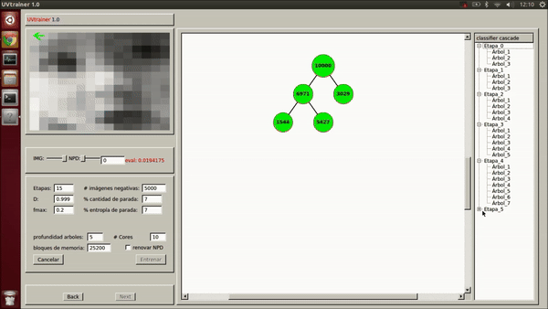

# UVtrainer
This software allows building a cascade of classifiers, where each stage of the cascade is an ensemble of regression tree classifiers that use NPD features for image evaluation.

**⚠️ Note:** The documentation for this project is currently in progress. Please check back later for updates.

    

## Author
Roger Figueroa Quintero - [LinkedIn Profile](https://www.linkedin.com/in/roger-figueroa-quintero/)

## License
This project is licensed under the [MIT License](LICENSE.md), allowing unrestricted use, modification, and distribution under the terms of the license.

